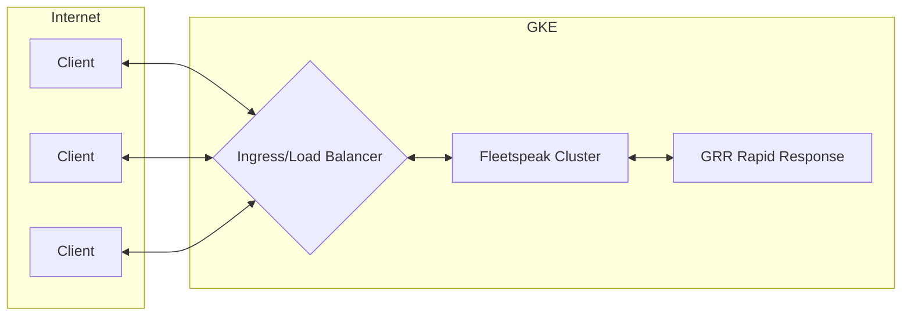
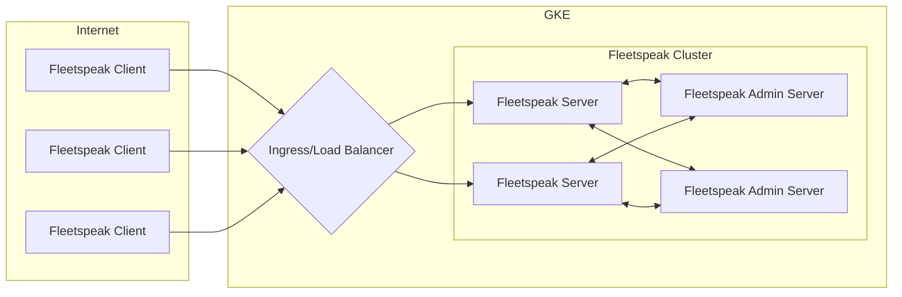

# Fleetspeak with Kubernetes

Fleetspeak is a protocol that is part of the Google's GRR Rapid Response incident response framework. It's primarily used to provide a secure connection from the GRR Server to clients/hosts.

<!-- truncate -->

## Big Picture

The environment I am using to test this is relativley straight forward. The clients are located on the public internet and the server which they need to communicate to is available through a Kubernets ingress resource, specifically GCE which will provide the TLS termination and load balancing for the deployment on a Kubernetes cluster in GCP.



## Ingress Types

TL;DR I am using the native GKE Ingress Controller.

Having worked with NGINX, Envoy, and GCE ingress controllers I much prefer Envoy as it seems to be the most flexible. That being said NGINX is easy if you are jumping in from a traditional reverse proxy as many of the concepts map 1-to-1 to nginx location/server blocks. For this environment I am choosing to stick with the GKE Ingress Controller as it is a first-party option when using GKE and won't require me to configure an additonal ingress controller for this cluster.

### GKE Ingress (L7 GCLB)

When using this ingress type we will be limited to HTTPS Header Mode, this will pass the client cert through an http header and since the Ingress controller will terminal TLS we will need to configure the ingress controller to pass the `client_certificate_checksum_header` to our deployment. 

### Envoy

Envoy can be used in several modes, we could transparently pass the traffic to avoid any terminating mTLS at the ingress and pass the certificate checksum header (more on this later). Envoy is great you should use it :)

### Nginx

Same story, very flexible. I have used the Nginx controller extensivley in the past but I am finding myself tending to write custom snippets which could be hard to maintain. Although this had worked well for me in the past I want to reduce the overhead of maintaining an NGINX Ingress config.

## Fleetspeak

Fleetspeak has a few more components than a traditional client-server architecture, here is a breif overview showing with the additon of the Fleetspeak server components



### Fleetspeak Server

The Fleetspeak Server consists of two components the Fleetspeak Admin Server and the Fleetspeak Server. Since fleetspeak uses gRPCs They are configured using protobufs.

Fleetspeak Server Config
```protobuf
mysql_data_source_name:"fleetspeak-user:fleetspeak-password@tcp(mysql-server:3306)/fleetspeakdb"
https_config: {
  listen_address: "0.0.0.0:9090"
  certificates:"FRONTEND_CERTIFICATE"
  key:"FRONTEND_KEY"
  frontend_config: {
    https_header_checksum_config: {
      client_certificate_header: "client-certificate"
      client_certificate_checksum_header: "x-client-cert-sha256-fingerprint"
    }
  }
}
admin_config: {
  listen_address: "0.0.0.0:9091"
}
health_check_config: {
  listen_address: "0.0.0.0:8080"
}
notification_use_http_notifier:false
```

### Fleetspeak Admin Server

Share the same config as the fleetspeak server, specifically the `admin_config` block, this should contain the `listen_address` which will correspond to the NodePort for the `fleetspeak-admin-server` deployment inside the Kubernetes cluster.

### Fleetspeak Server Kubernetes Manifest

```
```

### Front End Mode

There are several front-end modes that Fleetspeak can run in, because I am going to be using mTLS and terminate the TLS connection at the ingress controller I am opting to use **header mode** and configure my ingress controlle to pass the client cert checksum to the server.

### Fleetspeak Client Configuration

```protobuf
server: "fleetspeak-server.example.com:443"
client_certificate_header: "client-certificate"
trusted_certs:"FRONTEND_CERTIFICATE"
client_label: ""
filesystem_handler: {
  configuration_directory:"/config/fleetspeak-client"
  state_file:"/fleetspeak-client.state"
}
streaming:true
```

## Ingress

Now it's time to allow clients to speak with the fleetspeak server, the first thing we need to do is make sure that the clients can reach the fleetspeak server through the ingress controller.

#### Enable mTLS on Ingress

Manifeset

```
```

#### Pass checksum header to Fleetspeak

Backend Config

```
GCP BackendConfig
```
