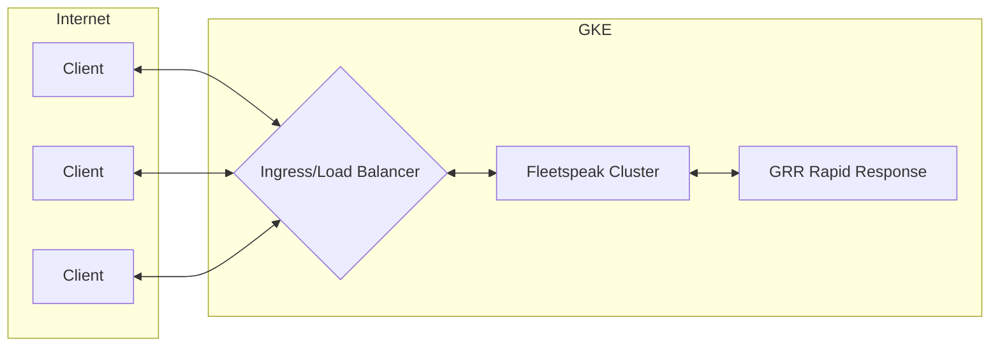
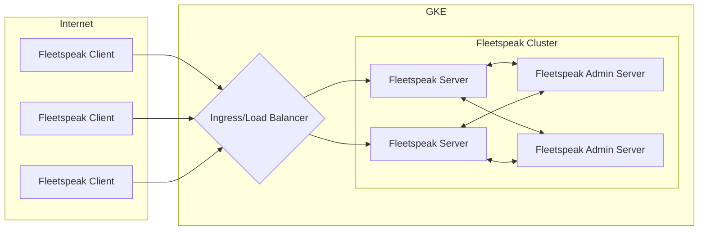

# Fleetspeak with Kubernetes

Fleetspeak is a protocol that is part of the Google's GRR Rapid Response incident response framework. It's primarily used to provide a secure connection from the GRR Server to clients/hosts. This post aimes to document my exploration of this tool.

## The environment

The environment I am using to test this is relativley straight forward. The clients are located on the public internet and the server which they need to communicate to is available on a kubernets ingress resource, specifically GCE which will provide the TLS termination for the publicly routable address.



## Ingress Types

Having worked with NGINX, Envoy, and GCE ingress controllers I much prefer Envoy as it seems to be the most feature complete. That being said NGINX is easy if you are jumping in from a traditional reverse proxy as many of the concepts map 1-to-1 to nginx location/server blocks. For this environment I am choosing to stick with the GCE controller as it is a first-party option when using GKE. 

## Fleetspeak

Fleetspeak has a few more components than a traditional client-server architecture, here is a breif overview of the Fleetspeak components



### Front End Modes

There are 5 front end modes that fleetspeak can run in but I find that there are actually 3 modes with the other 2 being variations on Header mode that a) use a cleartext connection to the fleetspeak cluster and b) drops the checksum that confirms if the certificate received by the Load Balacer is the same as the one that is being snt to the Fleetspeak Server.

1. Direct
The simplest solution, there is no ingress proxy to worry about we simple loadbalance the service and expose the https ports directly to the internet.

2. Passthrough
Pass the certs and TCP traffic through the ingress controller, this works well for NGINX and Envoy but GCE doesnt supprt this mode.

3. Header mode
Terminal mTLS at the ingress controller, the fleetspeak certs will be passed via HTTP headers 

I will be using Header mode as the other two modes don't allow this to be deployed in a modular fashion, it also appears to have first party support in GKE when using mTLS with the GCE ingress controller on GKE, go figure.


### Fleetspeak Server Configuration

The Fleetspeak Server consists of two components the Fleetspeak Admin Server and the Fleetspeak Server. They are configured using protobufs

### Fleetspeak Admin Server
```
```

### Fleetspeak Server
```
```

### Fleetspeak Client Configuration

#### Certificate fingerprints

#### Repack the clients

## Ingress

Now it's time to allow clients to speak with the fleetspeak server, the first thing we need to do is make sure that the clients can reach the fleetspeak server through the ingress controller.

#### Enable mTLS on Ingress


#### Pass checksum header to Fleetspeak

## Demo


## Takeaways


