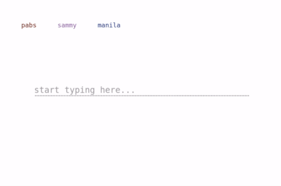

> A re-implementation of a unique chat app in node.js using RxJs for realtime events with websockets.

<!-- truncate -->

#### Live Demo

[https://interrupt-chat.glitch.me](https://interrupt-chat.glitch.me)

#### Source Code

[https://github.com/manila/interrupt-chat](https://github.com/manila/interrupt-chat)
